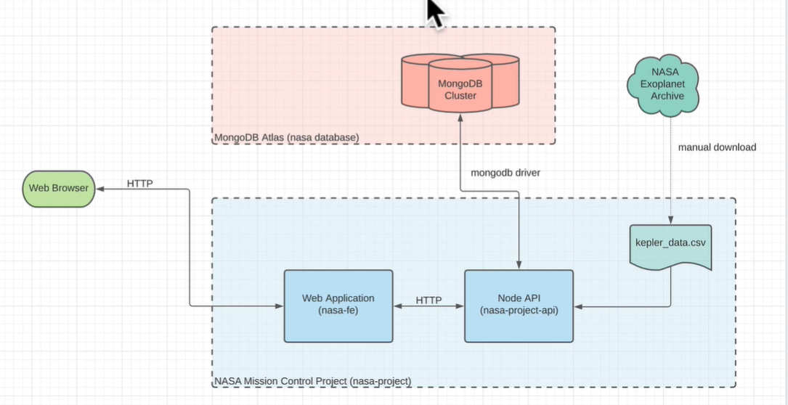

# MERN Full-Stack NASA Mission Control Project; Dockerized & Deployed on AWS EC2.

A MERN full-stack project simulating NASA mission control operations with NASA and SpaceX data. Dockerized and deployed on AWS EC2 for a scalable, production-ready setup using Node.js and MongoDB.

**Tools & Technologies:** MongoDB, Express.js, React.js, Hooks, Node.js, MongoDB Atlas, Docker, AWS EC2, JavaScript.

backend api url is "http://localhost:8000/v1"
coz port is 8000 and mounted on /v1

run both backend and front end together using "npm run watch"
